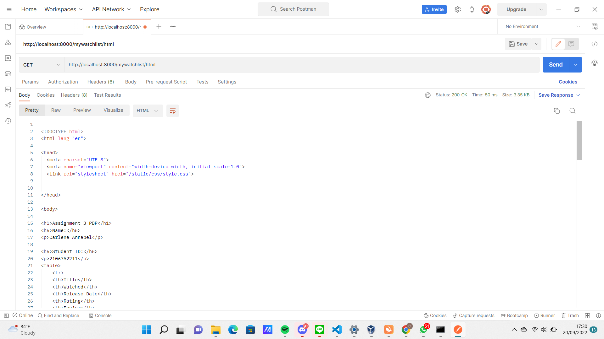
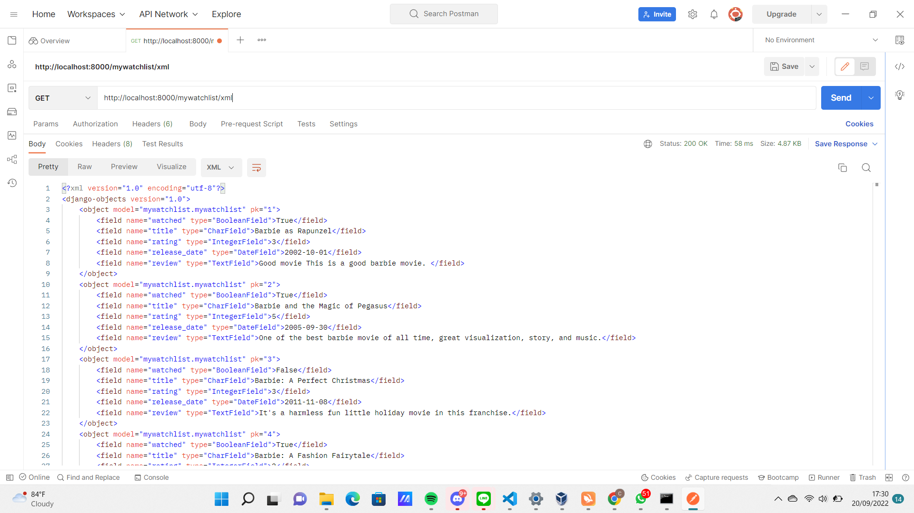
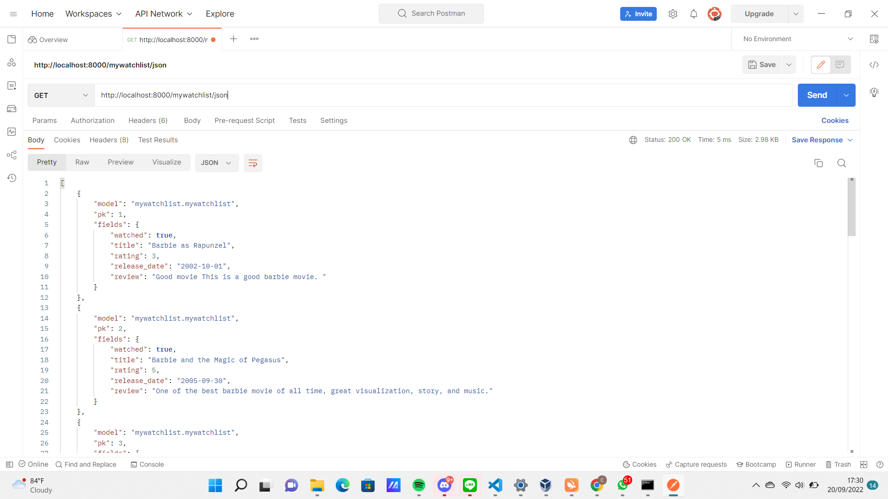

<a href="https://mywatchlist-carlene.herokuapp.com/mywatchlist/html/" target= "_blank">Link Aplikasi HTML</a>

<a href="https://mywatchlist-carlene.herokuapp.com/mywatchlist/xml/" target= "_blank">Link Aplikasi XML</a>

<a href="https://mywatchlist-carlene.herokuapp.com/mywatchlist/json/" target= "_blank">Link Aplikasi JSON</a>


##  **Jelaskan perbedaan antara JSON, XML, dan HTML!** 
XML dan HTML merupakan bahasa markup, HTML dirancang untuk memfasilitasi transfer dokumen berbasis web atau bagaimana format tampilan dari data. Sedangkan XML lebih kepada struktur dan konteksnya. Sedangkan JSON hanyalah format pertukaran data ringan yang jauh lebih mudah bagi komputer untuk mengurai data yang sedang dikirim. Pada HTML, data disimpan di dalam HTML. Sedangkan XML dapat memisahkan data dari HTML. Dengan XML, data disimpan diluar HTML. Pada JSON, data disimpan di dalam himpunan pasangan key-value. Data pada JSON human readable.

## **Jelaskan mengapa kita memerlukan data delivery dalam pengimplementasian sebuah platform?**
Dalam mengembangkan suatu platform, ada kalanya kita perlu mengirimkan data dari satu stack ke stack lainnya. Data yang dikirim juga bisa bermacam - macam bentuknya. Dengan data delivery, akan lebih mudah untuk mengirim data - data tersebut ke berbagai macam platform.

## **Jelaskan bagaimana cara kamu mengimplementasikan checklist di atas.**
1. Membuat aplikasi `mywatchlist` dengan perintah 
```js
django-admin startapp mywatchlist
```

2. Menambahkan aplikasi `mywatchlist` ke dalam variabel `INSTALLED_APPS` untuk mendaftarkan `django-app` yang sudah di buat ke dalam proyek Django.

3. Menambahkan potongan kode berikut ke dalam `models.py` yang ada pada `mywatchlist`

```js
from django.db import models
from django.core.validators import MaxValueValidator, MinValueValidator

class MyWatchList(models.Model):
    watched = models.BooleanField(default=False)
    title = models.CharField(max_length=255)
    rating = models.IntegerField(
        validators=[MaxValueValidator(5), MinValueValidator(1)]
    )
    release_date = models.DateField()
    review = models.TextField()
```

4. Melakukan perintah `python manage.py makemigrations` untuk mempersiapkan migrasi skema model ke dalam database Django lokal.

5. Menjalankan perintah `python manage.py migrate` untuk menerapkan skema model yang telah dibuat ke dalam database Django lokal.

6. Membuat folder `fixtures` di dalam folder aplikasi `mywatchlist` dan membuat berkas bernama `initial_mywatchlist_data.json` yang berisi kode data.

7. Menjalankan perintah `python manage.py loaddata initial_mywatchlist_data.json` untuk memasukkan data tersebut ke dalam database Django lokal.

8. Menambahkan fungsi berikut ke dalam `views.py`
```js
from django.shortcuts import render
from mywatchlist.models import MyWatchList

data_mywatchlist = MyWatchList.objects.all()
context = {
    'mywatchlist' : data_mywatchlist,
    'nama': 'Carlene Annabel',
    'student_id': '2106752211'
}
def show_mywatchlist(request):
    return render(request, "mywatchlist.html", context)
```

9. Membuat folder `templates` pada folder aplikasi `mywatchlist` dan membuat berkas bernama `mywatchlist.html`

10. Membuat sebuah berkas di dalam folder aplikasi `mywatchlist` bernama urls.py untuk melakukan routing terhadap fungsi views. Sebagai berikut
```js
from django.urls import path
from mywatchlist.views import show_mywatchlist
from mywatchlist.views import show_xml
from mywatchlist.views import show_json 

app_name = 'mywatchlist'

urlpatterns = [
    path('html/', show_mywatchlist, name='show_mywatchlist'),
    path('xml/', show_xml, name='show_xml'),
    path('json/', show_json, name='show_json'),
]
```

11. Mendaftarkan aplikasi `mywatchlist` ke dalam `urls.py` yang ada pada folder `project_django` dengan menambahkan potongan kode berikut pada variabel `urlpatterns`.
```js
...
path('mywatchlist/', include('mywatchlist.urls')),
...
```
12. Mapping data yang ada pada fungsi `views` dan memunculkannya di halaman HTML dengan kode berikut
```js

   

<h1>Assignment 3 PBP</h1>
<h5>Name:</h5>
<p>{{nama}}</p>

<h5>Student ID:</h5>
<p>{{student_id}}</p>
<table>
    <tr>
    <th>Title</th>
    <th>Watched</th>
    <th>Release Date</th>
    <th>Rating</th>
    <th>Review</th>
    </tr>
     Tambahkan data di bawah baris ini 
    
    <tr>
        <td>{{movie.title}}</td>
        <td>{{movie.watched}}</td>
        <td>{{movie.release_date}}</td>
        <td>{{movie.rating}}</td>
        <td>{{movie.review}}</td>
    </tr>
    
</table>


```
13. Mengembalikan data dalam bentuk XML dan JSON dengan menambahkan kode berikut pada `views.py`
```js
from django.http import HttpResponse
from django.core import serializers
...
def show_xml(request):
    return HttpResponse(serializers.serialize("xml", data_mywatchlist), content_type="application/xml")

def show_json(request):
    return HttpResponse(serializers.serialize("json", data_mywatchlist), content_type="application/json")
```
14. Import fungsi yang sudah dibuat ke dalam `urls.py` pada folder `mywatchlist`
```js
from mywatchlist.views import show_xml
from mywatchlist.views import show_json 
```
15. Menambahkan path url ke dalam `urlpatterns` untuk mengakses fungsi yang sudah diimpor tadi.
```js
...
path('xml/', show_xml, name='show_xml'),
path('json/', show_json, name='show_json'),
...
```
16. Membuat unit testing pada tests.py
```js
from django.test import TestCase, Client
from django.urls import reverse
class MyWatchListViewTest(TestCase):

    def test_view_url_html_exists_at_desired_location(self):
        self.client = Client()
        response = self.client.get('/mywatchlist/html/')
        self.assertEqual(response.status_code, 200)
    
    def test_view_url_xml_exists_at_desired_location(self):
        self.client = Client()
        response = self.client.get('/mywatchlist/xml/')
        self.assertEqual(response.status_code, 200)

    def test_view_url_json_exists_at_desired_location(self):
        self.client = Client()
        response = self.client.get('/mywatchlist/json/')
        self.assertEqual(response.status_code, 200)

    def test_view_url_accessible_by_name_html(self):
        self.client = Client()
        response = self.client.get(reverse('mywatchlist:show_mywatchlist'))
        self.assertEqual(response.status_code, 200)

    def test_view_url_accessible_by_name_xml(self):
        self.client = Client()
        response = self.client.get(reverse('mywatchlist:show_xml'))
        self.assertEqual(response.status_code, 200)

    def test_view_url_accessible_by_name_json(self):
        self.client = Client()
        response = self.client.get(reverse('mywatchlist:show_json'))
        self.assertEqual(response.status_code, 200)
```
16. Memodifikasi `settings.py` agar dapat menjalankan `tests.py`
```js
...
import sys
TESTING = len(sys.argv)>1 and sys.argv[1] == 'test'
STATICFILES_STORAGE = (
    'django.contrib.staticfiles.storage.StaticFilesStorage'
    if TESTING
    else 'whitenoise.storage.CompressedManifestStaticFilesStorage'
)
...
```
17. Menjalankan `test.py` dengan memasukkan perintah `python manage.py collectstatic` dan `python manage.py test`

18. Mengubah isi `Procfile` release dengan 
```js
release: sh -c 'python manage.py migrate && python manage.py loaddata initial_catalog_data.json && python manage.py loaddata initial_mywatchlist_data.json'
```
19. Deploy project ke HEROKU!

## **Mengakses tiga URL menggunakan Postman, menangkap screenshot**





